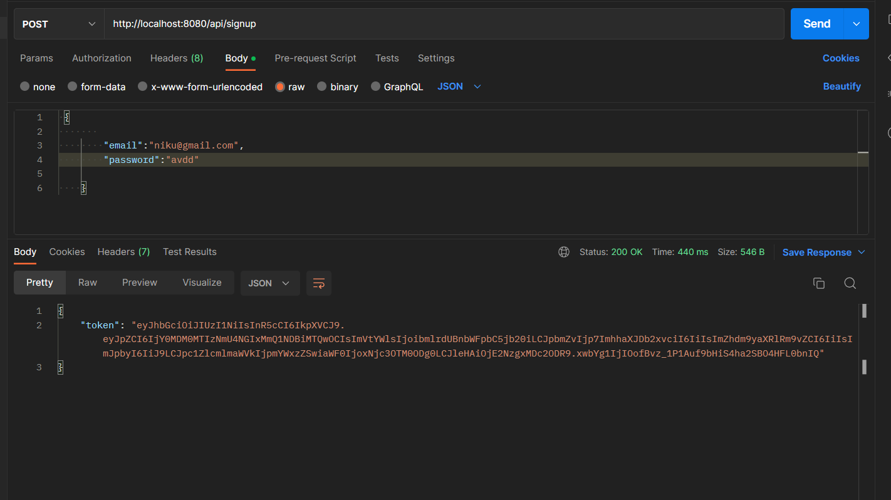
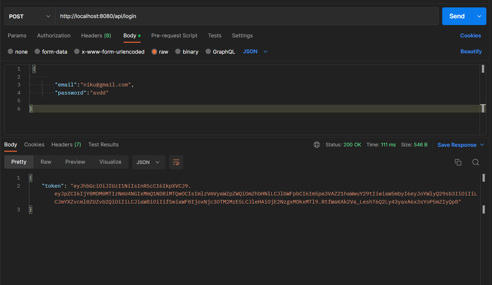
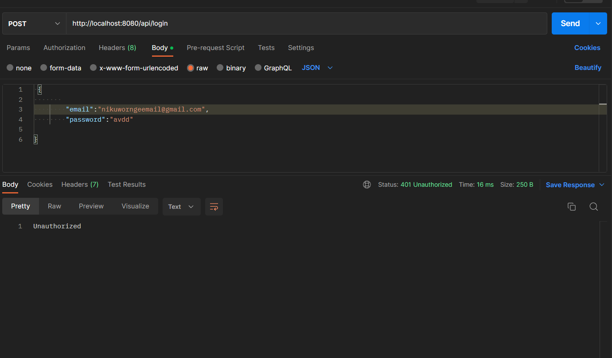
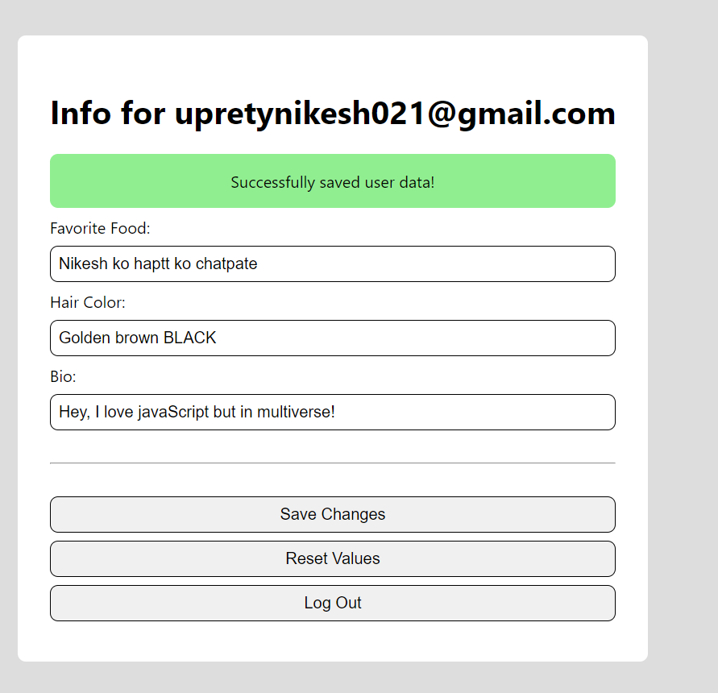

# Generating JSON Web Tokens.
## For signUpRoute
So, we created an `.env` file which contains JWT_SECRET key that I had set,
Next on the `singUpRoute` on the backend, we added that JWT_SECRET token and send to out routes, also we added an expireIn and errorr if something in the server .

Now, I sent an post req to the route with email and password in JSON format and I received an JSON token as a response, .

## For loginInRoute,
Same as before we imported some library we need such as `bcrypt` `jwt` and `getDbConnection`.
Now after that we have create an route which takes res.body which inlcudes email and password and with post method , then after connecting with our DB we finded that email user in our database and set an condition which throws error if the user doesn't exits and if the user does exits the, password hash is checked and after that the it is signed with the JWT_SECRET and JSON token is generated.

Here is the final code.
```javascript
import bcrypt from 'bcrypt';
import jwt from 'jsonwebtoken';
import { getDbConnection } from '../db.js';

export const logInRoute = {
    path: '/api/login',
    method: 'post',
    handler: async (req, res) => {
        const { email, password } = req.body;

        const db = getDbConnection('react-auth-db');
        const user = await db.collection('users').findOne({ email });

        if (!user) return res.sendStatus(401);

        const { _id: id, isVerified, passwordHash, info } = user;

        const isCorrect = await bcrypt.compare(password, passwordHash);

        if (isCorrect) {
            jwt.sign({ id, isVerified, email, info }, process.env.JWT_SECRET, { expiresIn: '2d' }, (err, token) => {
                if (err) {
                    res.status(500).json(err);
                }

                res.status(200).json({ token });
            });
        } else {
            res.sendStatus(401);
        }
    },
}
```




And if I enter, wronge email or password, it says unauthorized.


## Implementing JWTs on the front end.
We are going to create two seperate hook ` useToken` & `useUser` in out auth folder .

Here is the final code for both of the hooks
useUser
This will get the token payload from the JSON web token and return the user of the token exists.

```javascript
import { useState, useEffect } from 'react';
import { useToken } from './useToken';

export const useUser = () => {
    const [token] = useToken();

    const getPayloadFromToken = token => {
        const encodedPayload = token.split('.')[1];
        return JSON.parse(atob(encodedPayload));
    }

    const [user, setUser] = useState(() => {
        if (!token) return null;
        return getPayloadFromToken(token);
    });

    useEffect(() => {
        if (!token) {
            setUser(null);
        } else {
            setUser(getPayloadFromToken(token));
        }
    }, [token]);

    return user;
}
```
useToken
This is get the token from the localstorage . 

```javascript
import { useState } from 'react';

export const useToken = () => {
    const [token, setTokenInternal] = useState(() => {
        return localStorage.getItem('token');
    });

    const setToken = newToken => {
        localStorage.setItem('token', newToken);
        setTokenInternal(newToken);
    }

    return [token, setToken];
}
```

## Setting up these hooks inout login and signup page!

## For signup page
In the `signuppage` we imported the `useToken` and also `axios` to load the  data from the server.
Then we sent post req to the server router, which containes the req.boy email and password and respond with the token that weill be set.
Here is the final code,
```javascript
import { useState } from 'react';
import { useHistory } from 'react-router-dom';
import axios from 'axios';
import { useToken } from '../auth/useToken.js';

export const SignUpPage = () => {
    const [token, setToken] = useToken();

    const [errorMessage, setErrorMessage] = useState('');

    const [emailValue, setEmailValue] = useState('');
    const [passwordValue, setPasswordValue] = useState('');
    const [confirmPasswordValue, setConfirmPasswordValue] = useState('');

    const history = useHistory();

    const onSignUpClicked = async () => {
        const response = await axios.post('/api/signup', {
            email: emailValue,
            password: passwordValue,
        });
        const { token } = response.data;
        setToken(token);
        history.push('/');
    }

    return (
        <div className="content-container">
            <h1>Sign Up</h1>
            {errorMessage && <div className="fail">{errorMessage}</div>}
            <input
                value={emailValue}
                onChange={e => setEmailValue(e.target.value)}
                placeholder="someone@gmail.com" />
            <input
                type="password"
                value={passwordValue}
                onChange={e => setPasswordValue(e.target.value)}
                placeholder="password" />
            <input
                type="password"
                value={confirmPasswordValue}
                onChange={e => setConfirmPasswordValue(e.target.value)}
                placeholder="password" />
            <hr />
            <button
                disabled={
                    !emailValue || !passwordValue ||
                    passwordValue !== confirmPasswordValue
                }
                onClick={onSignUpClicked}>Sign Up</button>
            <button onClick={() => history.push('/login')}>Already have an account? Log In</button>
        </div>
    );
}
```

Also made some changes to our `PrivateRoute` page by changing the user = null to user = useUser after importing useUser hook from ./auth/useUser.js
Here is the final code.
```javascript
import { Redirect, Route } from 'react-router-dom';
import { useUser } from './useUser';

export const PrivateRoute = props => {
    const user = useUser();

    if (!user) return <Redirect to="/login" />

    return <Route {...props} />
}
```

Now I runned my project and checked if it is actually working or not,
First I signed up a new user and Check the JSON web token it generated for that user.


Then if we delete our token, we get logged out and redirect to the login page.


## For login page.
We are start by importing axios and useToken same as signuppage, and we are going to do pretty much same thing as signuppage.
Then, we are going the send an post request of req.body email and password same as the signuppage and we get token out of the response and we are going to send the user to userinfo page with history.

Here is the final code.
```javascript
import { useState } from 'react';
import { useHistory } from 'react-router-dom';
import axios from 'axios';
import { useToken } from '../auth/useToken';

export const LogInPage = () => {
    const [token, setToken] = useToken();

    const [errorMessage, setErrorMessage] = useState('');

    const [emailValue, setEmailValue] = useState('');
    const [passwordValue, setPasswordValue] = useState('');

    const history = useHistory();

    const onLogInClicked = async () => {
        const response = await axios.post('/api/login', {
            email: emailValue,
            password: passwordValue,
        });
        const { token } = response.data;
        setToken(token);
        history.push('/');
    }

    return (
        <div className="content-container">
            <h1>Log In</h1>
            {errorMessage && <div className="fail">{errorMessage}</div>}
            <input
                value={emailValue}
                onChange={e => setEmailValue(e.target.value)}
                placeholder="someone@gmail.com" />
            <input
                type="password"
                value={passwordValue}
                onChange={e => setPasswordValue(e.target.value)}
                placeholder="password" />
            <hr />
            <button
                disabled={!emailValue || !passwordValue}
                onClick={onLogInClicked}>Log In</button>
            <button onClick={() => history.push('/forgot-password')}>Forgot your password?</button>
            <button onClick={() => history.push('/signup')}>Don't have an account? Sign Up</button>
        </div>
    );
}
```

## Adding update user route, for UserInfo page
- We made an new file, imported the basic libraries, and send an post request to the server with req.body of favfoos, haircolor and bio, also, we checked the JSON we token and an error if the token is tempered.
Here is the final code!
```javascript
import jwt from 'jsonwebtoken';
import { ObjectID } from 'mongodb';
import { getDbConnection } from '../db';

export const updateUserInfoRoute = {
    path: '/api/users/:userId',
    method: 'put',
    handler: async (req, res) => {
        const { authorization } = req.headers;
        const { userId } = req.params;

        const updates = (({
            favoriteFood,
            hairColor,
            bio,
        }) => ({
            favoriteFood,
            hairColor,
            bio,
        }))(req.body);

        if (!authorization) {
            return res.status(401).json({ message: 'No authorization header sent' });
        }

        const token = authorization.split(' ')[1];
        ```
## Verifying JSON Web Tokens
```javascript
		// This code continues from the above code
        jwt.verify(token, process.env.JWT_SECRET, async (err, decoded) => {
            if (err) return res.status(401).json({ message: 'Unable to verify token' });

            const { id } = decoded;

            if (id !== userId) return res.status(403).json({ message: 'Not allowed to update that user\'s data' });

            const db = getDbConnection('react-auth-db');
            const result = await db.collection('users').findOneAndUpdate(
                { _id: ObjectID(id) },
                { $set: { info: updates } },
                { returnOriginal: false },
            );
            const { email, isVerified, info } = result.value;

            jwt.sign({ id, email, isVerified, info }, process.env.JWT_SECRET, { expiresIn: '2d' }, (err, token) => {
                if (err) {
                    return res.status(200).json(err);
                }
                res.status(200).json({ token });
            });
        })
    }
}
```

## Adding JWTs to the user info page
 Now, here we imported `useToken` , `useUser` and `axios`.
 Then we changed the useState (' ') empty value to useState( info.Userdata || ' ')
 And, we sent the put request to the server route with userinfo such as `favouratefood`, `haircolor` and `bio` in the req.body. 
 Latyle we added a header that contains the token that we store in the local storage.
 Now we get the new token the server will send us back, and the we set the token using the `setToken` hook.
Here is the final code 
```javascript
import { useState, useEffect } from 'react';
import { useHistory } from 'react-router-dom';
import axios from 'axios';
import { useToken } from '../auth/useToken';
import { useUser } from '../auth/useUser';

export const UserInfoPage = () => {
    const user = useUser();
    const [token, setToken] = useToken();

    const { id, email, info } = user;

    // We'll use the history to navigate the user
    // programmatically later on (we're not using it yet)
    const history = useHistory();

    // These states are bound to the values of the text inputs
    // on the page (see JSX below). 
    const [favoriteFood, setFavoriteFood] = useState(info.favoriteFood || '');
    const [hairColor, setHairColor] = useState(info.hairColor || '');
    const [bio, setBio] = useState(info.bio || '');

    // These state variables control whether or not we show
    // the success and error message sections after making
    // a network request (see JSX below).
    const [showSuccessMessage, setShowSuccessMessage] = useState(false);
    const [showErrorMessage, setShowErrorMessage] = useState(false);

    // This useEffect hook automatically hides the
    // success and error messages after 3 seconds when they're shown.
    // Just a little user interface improvement.
    useEffect(() => {
        if (showSuccessMessage || showErrorMessage) {
            setTimeout(() => {
                setShowSuccessMessage(false);
                setShowErrorMessage(false);
            }, 3000);
        }
    }, [showSuccessMessage, showErrorMessage]);

    const saveChanges = async () => {
        try {
            const response = await axios.put(`/api/users/${id}`, {
                favoriteFood,
                hairColor,
                bio,
            }, {
                headers: { Authorization: `Bearer ${token}` }
            });

            const { token: newToken } = response.data;
            setToken(newToken);
            setShowSuccessMessage(true);
        } catch (error) {
            setShowErrorMessage(true);
        }
    }

    const logOut = () => {
        // We'll want to log the user out here
        // and send them to the "login page"
        alert('Log out functionality not implemented yet');
    }
    
    const resetValues = () => {
        setFavoriteFood(info.favoriteFood);
        setHairColor(info.hairColor);
        setBio(info.bio);
    }
    
    // And here we have the JSX for our component. It's pretty straightforward
    return (
        <div className="content-container">
            <h1>Info for {email}</h1>
            {showSuccessMessage && <div className="success">Successfully saved user data!</div>}
            {showErrorMessage && <div className="fail">Uh oh... something went wrong and we couldn't save changes</div>}
            <label>
                Favorite Food:
                <input
                    onChange={e => setFavoriteFood(e.target.value)}
                    value={favoriteFood} />
            </label>
            <label>
                Hair Color:
                <input
                    onChange={e => setHairColor(e.target.value)}
                    value={hairColor} />
            </label>
            <label>
                Bio:
                <input
                    onChange={e => setBio(e.target.value)}
                    value={bio} />
            </label>
            <hr />
            <button onClick={saveChanges}>Save Changes</button>
            <button onClick={resetValues}>Reset Values</button>
            <button onClick={logOut}>Log Out</button>
        </div>
    );
}
```

Lastly we addde the `updateuserIntoroute` route to index.js file in the backend
Here is the code 
```javascript
import { testRoute } from './testRoute.js';
import { signUpRoute } from './signUpRoute.js';
import { logInRoute } from './logInRoute.js';
import updateUserInfoRoute from './updateUserInfoRoute.js';

 const routes = [
    logInRoute,
    signUpRoute,
    testRoute,
    updateUserInfoRoute,

];
 export default routes

```

While testing there is some error which I am figuring out.

So the error was due to the mongodb version mismatch, I haved copied file package.json and other files from the exercise file folder, and that exercise file folder mongodb version was lower then that which I was currently using, so I checked my mongodb version my typing 

`npm list mongodb`
And I replaced the older version the my version in the package.json file

## Adding logout functionality
In jwt logout is implemented by basically deleting the JSON token that we have in out local storage.
We head back towards to our userinfo page
And write an simple code.
Here is an example 
```javascript
    const logOut = () => {
      
        localStorage.removeItem('token');
        history.push('/login');
    }
    
```
