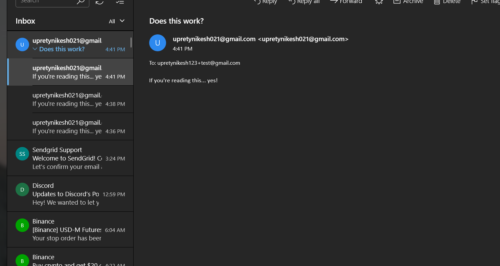
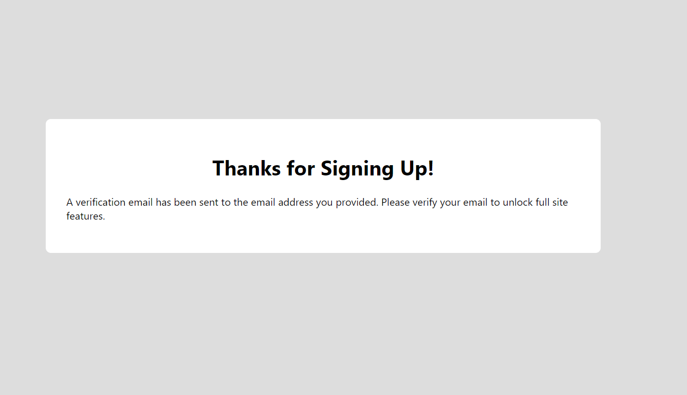
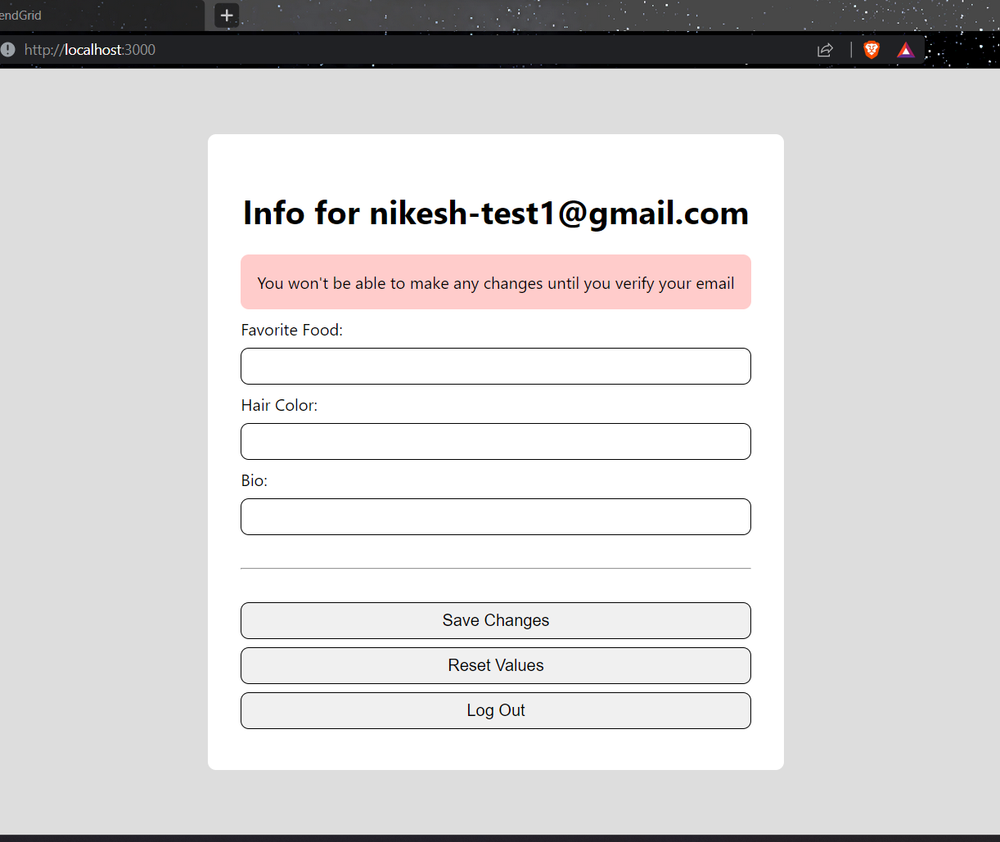
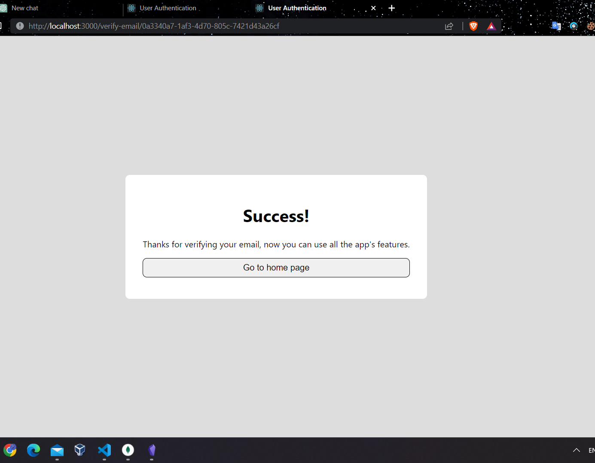
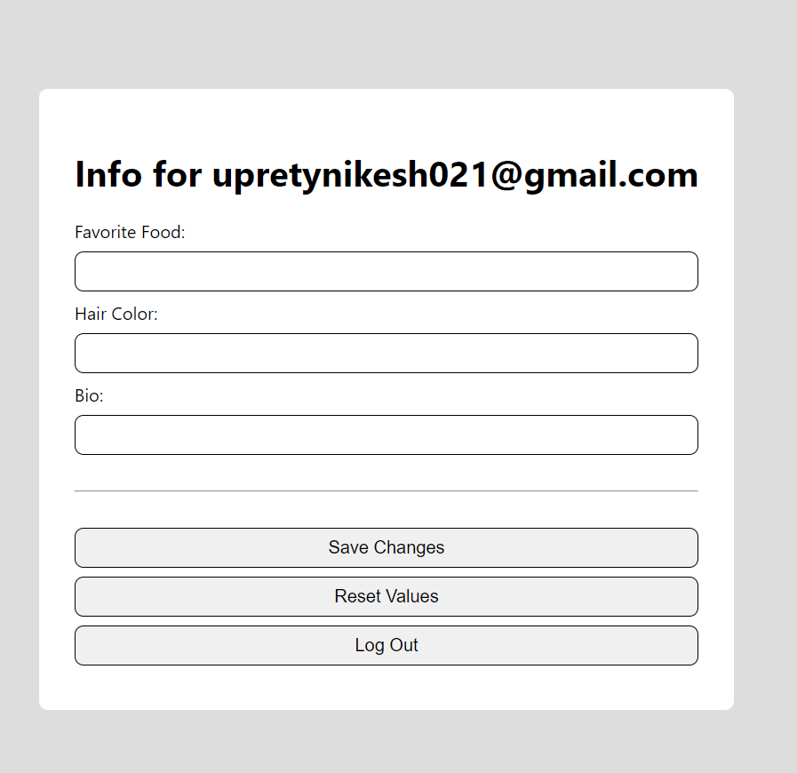

# Email Verification
We need to make sure that our users own the email addresses they're signing up with.
## Email Verification Steps
1. The user creates a new account with their email and password.
2. The server adds this information to the database.
3. The server also generates a secret verification hash.
4. The server sends an email link with this verification hash to the provided email address.
5. If the user really owns the email, they can click this link, which sends them to a special landing page in out application
6. The landing page pareses the verification hash from the URL and sends it to the server.
7. If the verification hash matches, the user is marked as 'verified.'
## Setting up an email provider.
For this I created an account in sendgrid.com which provides free email services to use in our app development.
Then I clicked on create identity and filled out the information required for that process, and we verified the senders email throught the mail that received in our email, which we have set in the above process!
They we head toward the Email API and integration guide, select web app and node server. 
We coped the api key and opend up the `.env` and we create another environment variable.
Then we installed the sendgrid npm package as given in the offical website.
`npm install --save @sendgrid/mail`

Now we created an sendemail function with the use of sendgrid
```javascript
import sendgrid from '@sendgrid/mail';

sendgrid.setApiKey(process.env.SENDGRID_API_KEY);

export const sendEmail = ({ to, from, subject, text, html }) => {
    const msg = { to, from, subject, text, html };
    return sendgrid.send(msg);
}
```

Also, we created an new route called testEmailROute.
```javascript
import { sendEmail } from '../util/sendEmail';

export const testEmailRoute = {
    path: '/api/test-email',
    method: 'post',
    handler: async (req, res) => {
        try {
            await sendEmail({
                to: 'upretynikesh123@gmail.com',
                from: 'upretynikesh021@gmail.com',
                subject: 'Does this work?',
                text: 'If you\'re reading this... yes!',
            });
            res.sendStatus(200);
        } catch (e) {
            console.log(e);
            res.sendStatus(500);
        }
    }
}
```

Now, final thing is we added the route to our index file and checked if the emai was sent successfully or not.
```javascript
import { testRoute } from './testRoute.js';
import { signUpRoute } from './signUpRoute.js';
import { logInRoute } from './logInRoute.js';
import { updateUserInfoRoute } from './updateUserInfoRoute.js';
import { testEmailRoute } from './testEmailRoute.js';
 const routes = [
    logInRoute,
    signUpRoute,
    testEmailRoute,
    testRoute,
    updateUserInfoRoute,

];
 export default routes

```

### Tesing in postman

Viewing the actual email


## Integrating verification tokens
To generated the codes that is required to verify the email, we installed an npm package `npm install uuid`
After that we imported it in our singnUpRoute page as `import { v4 as uuid } from 'uuid';`
Hers is the example, 
```javascript
 const verificationString = uuid();

        const startingInfo = {
            hairColor: '',
            favoriteFood: '',
            bio: '',
        };

        const result = await db.collection('users').insertOne({
            email,
            passwordHash,
            info: startingInfo,
            isVerified: false,
            verificationString,
        });
        const { insertedId } = result;

        try {
            await sendEmail({
                to: email,
                from: 'upretynikesh021@gmail.com',
                subject: 'Please verify your email',
                text: `
                    Thanks for signing up! To verify your email, click here:
                    http://localhost:3000/verify-email/${verificationString}
                `,
            });
        } catch (e) {
            console.log(e);
            res.sendStatus(500);
        }
```

And, here is the final code,
```javascript
import bcrypt from 'bcrypt';
import jwt from 'jsonwebtoken';
import { v4 as uuid } from 'uuid';
import { getDbConnection } from '../db.js';
import { sendEmail } from '../util/sendEmail.js';

export const signUpRoute = {
    path: '/api/signup',
    method: 'post',
    handler: async (req, res) => {
        const { email, password } = req.body;

        const db = getDbConnection('react-auth-db');
        const user = await db.collection('users').findOne({ email });

        if (user) {
            res.sendStatus(409);
        }

        const passwordHash = await bcrypt.hash(password, 10);

        const verificationString = uuid();

        const startingInfo = {
            hairColor: '',
            favoriteFood: '',
            bio: '',
        };

        const result = await db.collection('users').insertOne({
            email,
            passwordHash,
            info: startingInfo,
            isVerified: false,
            verificationString,
        });
        const { insertedId } = result;

        try {
            await sendEmail({
                to: email,
                from: 'upretynikesh021@gmail.com',
                subject: 'Please verify your email',
                text: `
                    Thanks for signing up! To verify your email, click here:
                    http://localhost:3000/verify-email/${verificationString}
                `,
            });
        } catch (e) {
            console.log(e);
            res.sendStatus(500);
        }

        jwt.sign({
            id: insertedId,
            email,
            info: startingInfo,
            isVerified: false,
        },
        process.env.JWT_SECRET,
        {
            expiresIn: '2d',
        },
        (err, token) => {
            if (err) {
                return res.status(500).send(err);
            }
            res.status(200).json({ token });
        });
    }
}
```
 Also in the updateUserInfo page we have add a condition which states if the user is not verified he/she cannot make change or update their information
 Here is the final code,
```javascript
import jwt from 'jsonwebtoken';
import ObjectID  from 'mongodb';
import { getDbConnection } from '../db.js';

export const updateUserInfoRoute = {
    path: '/api/users/:userId',
    method: 'put',
    handler: async (req, res) => {
        const { authorization } = req.headers;
        const { userId } = req.params;

        const updates = (({
            favoriteFood,
            hairColor,
            bio,
        }) => ({
            favoriteFood,
            hairColor,
            bio,
        }))(req.body);

        if (!authorization) {
            return res.status(401).json({ message: 'No authorization header sent' });
        }

        const token = authorization.split(' ')[1];

        jwt.verify(token, process.env.JWT_SECRET, async (err, decoded) => {
            if (err) return res.status(401).json({ message: 'Unable to verify token' });

            const { id, isVerified } = decoded;

            if (id !== userId) return res.status(403).json({ message: 'Not allowed to update that user\'s data' });
            if (!isVerified) return res.status(403).json({ message: 'You need to verify your email before you can update your data'})

            const db = getDbConnection('react-auth-db');
            const result = await db.collection('users').findOneAndUpdate(
                { _id: ObjectID(id) },
                { $set: { info: updates } },
                { returnOriginal: false },
            );
            const { email, info } = result.value;

            jwt.sign({ id, email, isVerified, info }, process.env.JWT_SECRET, { expiresIn: '2d' }, (err, token) => {
                if (err) {
                    return res.status(200).json(err);
                }
                res.status(200).json({ token });
            });
        })
    }
}
```

## Creating a verify email page
We made a new page in out frontend name PleaseVerifyEmailPage which basically sends the users after he had clicked the link, saying an message,
Here is the final code for that page
```javascript
import { useEffect } from 'react';
import { useHistory } from 'react-router-dom';

export const PleaseVerifyEmailPage = () => {
    const history = useHistory();

    useEffect(() => {
        setTimeout(() => {
            history.push('/');
        }, 3000);
    }, [history]);

    return (
        <div className="content-container">
            <h1>Thanks for Signing Up!</h1>
            <p>
                A verification email has been sent to the email address you provided.
                Please verify your email to unlock full site features.
            </p>
        </div>
    );
}
```
Now adding the above file to our routes
```javascript
import { BrowserRouter as Router, Route, Switch } from 'react-router-dom';
import { LogInPage } from './pages/LogInPage';
import { SignUpPage } from './pages/SignUpPage';
import { UserInfoPage } from './pages/UserInfoPage';
import { PrivateRoute } from './auth/PrivateRoute';
import { PleaseVerifyEmailPage } from './pages/PleaseVerifyEmailPage';

export const Routes = () => {
    return (
        <Router>
            <Switch>
                <PrivateRoute path="/" exact>
                    <UserInfoPage />
                </PrivateRoute>
                <Route path="/login">
                    <LogInPage />
                </Route>
                <Route path="/please-verify">
                    <PleaseVerifyEmailPage/>
                </Route>
                <Route path="/signup">
                    <SignUpPage />
                </Route>
            </Switch>
        </Router>
    );
}
```
Now we have to navigate to this page instead of userpage that we have, so to do so, we head to the signuppage and changed the `history.push ( '/ ')`   to  `history.push ( '/please-verify ' ) `


Here is the final code
```javascript
import { useState, useEffect } from 'react';
import { useHistory } from 'react-router-dom';
import axios from 'axios';
import { useToken } from '../auth/useToken';
import { useUser } from '../auth/useUser';

export const UserInfoPage = () => {
    const user = useUser();
    const [token, setToken] = useToken();

    const { id, email, isVerified, info } = user;

    // We'll use the history to navigate the user
    // programmatically later on (we're not using it yet)
    const history = useHistory();

    // These states are bound to the values of the text inputs
    // on the page (see JSX below). 
    const [favoriteFood, setFavoriteFood] = useState(info.favoriteFood || '');
    const [hairColor, setHairColor] = useState(info.hairColor || '');
    const [bio, setBio] = useState(info.bio || '');

    // These state variables control whether or not we show
    // the success and error message sections after making
    // a network request (see JSX below).
    const [showSuccessMessage, setShowSuccessMessage] = useState(false);
    const [showErrorMessage, setShowErrorMessage] = useState(false);

    // This useEffect hook automatically hides the
    // success and error messages after 3 seconds when they're shown.
    // Just a little user interface improvement.
    useEffect(() => {
        if (showSuccessMessage || showErrorMessage) {
            setTimeout(() => {
                setShowSuccessMessage(false);
                setShowErrorMessage(false);
            }, 3000);
        }
    }, [showSuccessMessage, showErrorMessage]);

    const saveChanges = async () => {
        try {
            const response = await axios.put(`/api/users/${id}`, {
                favoriteFood,
                hairColor,
                bio,
            }, {
                headers: { Authorization: `Bearer ${token}` }
            });

            const { token: newToken } = response.data;
            setToken(newToken);
            setShowSuccessMessage(true);
        } catch (error) {
            setShowErrorMessage(true);
        }
    }

    const logOut = () => {
      
        localStorage.removeItem('token');
        history.push('/login');
    }
    
    const resetValues = () => {
        setFavoriteFood(info.favoriteFood);
        setHairColor(info.hairColor);
        setBio(info.bio);
    }
    
    // And here we have the JSX for our component. It's pretty straightforward
    return (
        <div className="content-container">
            <h1>Info for {email}</h1>
            {!isVerified && <div className='fail'>You won't be able to make any changes until you verify your email</div> }
            {showSuccessMessage && <div className="success">Successfully saved user data!</div>}
            {showErrorMessage && <div className="fail">Uh oh... something went wrong and we couldn't save changes</div>}
            <label>
                Favorite Food:
                <input
                    onChange={e => setFavoriteFood(e.target.value)}
                    value={favoriteFood} />
            </label>
            <label>
                Hair Color:
                <input
                    onChange={e => setHairColor(e.target.value)}
                    value={hairColor} />
            </label>
            <label>
                Bio:
                <input
                    onChange={e => setBio(e.target.value)}
                    value={bio} />
            </label>
            <hr />
            <button onClick={saveChanges}>Save Changes</button>
            <button onClick={resetValues}>Reset Values</button>
            <button onClick={logOut}>Log Out</button>
        </div>
    );
}
```



## Adding a verify email route.

To do this, we need to change both in our front-end and back-end, let's start with backend
### Backend
First we made an verifyEmailRoute file and in that file, we made an put request which send the verificationString and find the user with this verificationString, this is done by getting the using id. 
If the id matched we are going to set isverified:true;
Here is the final code,
```javascript
import { ObjectID } from 'mongodb';
import jwt from 'jsonwebtoken';
import { getDbConnection } from '../db.js';

export const verifyEmailRoute = {
    path: '/api/verify-email',
    method: 'put',
    handler: async (req, res) => {
        const { verificationString } = req.body;
        const db = getDbConnection('react-auth-db');
        const result = await db.collection('users').findOne({
            verificationString,
        });

        if (!result) return res.status(401).json({ message: 'The email verification code is incorrect' });

        const { _id: id, email, info } = result;

        await db.collection('users').updateOne({ _id: ObjectID(id) }, {
            $set: { isVerified: true }
        });

        jwt.sign({ id, email, isVerified: true, info }, process.env.JWT_SECRET, { expiresIn: '2d' }, (err, token) => {
            if (err) return res.sendStatus(500);
            res.status(200).json({ token });
        });
    }
}
```
After that we exported that route in our index.js file
```javascript
import { testRoute } from './testRoute.js';
import { signUpRoute } from './signUpRoute.js';
import { logInRoute } from './logInRoute.js';
import { updateUserInfoRoute } from './updateUserInfoRoute.js';
import { testEmailRoute } from './testEmailRoute.js';
import { verifyEmailRoute } from './verifyEmailRoute.js';
 const routes = [
    logInRoute,
    signUpRoute,
    testEmailRoute,
    testRoute,
    updateUserInfoRoute,
    verifyEmailRoute,

];
 export default routes

```

### Frontend
Next thing I do in our front end is I create an new page which will be the landing page of emailverification after the user clicks the link from the email
And also, two componets if the user account is verified and verified unsuccessfull.

Here is the final code of page `EmailVerificationLandingPage`
```javascript
import { useState, useEffect } from 'react';
import { useParams } from 'react-router-dom';
import axios from 'axios';
import { useToken } from '../auth/useToken';
import { EmailVerificationSuccess } from './EmailVerificationSuccess';
import { EmailVerificationFail } from './EmailVerificationFail';

export const EmailVerificationLandingPage = () => {
    const [isLoading, setIsLoading] = useState(true);
    const [isSuccess, setIsSuccess] = useState(false);
    const { verificationString } = useParams();
    const [,setToken] = useToken();

    useEffect(() => {
        const loadVerification = async () => {
            try {
                const response = await axios.put('/api/verify-email', { verificationString });
                const { token } = response;
                setToken(token);
                setIsSuccess(true);
                setIsLoading(false);
            } catch (e) { 
                setIsSuccess(false);
                setIsLoading(false);
            }
        }

        loadVerification();
    }, [setToken, verificationString]);

    if (isLoading) return <p>Loading...</p>;
    if (!isSuccess) return <EmailVerificationFail />
    return <EmailVerificationSuccess />
}
```

Now, here is the final code for page `EmailVerificationSuccess` which displays the page it the verification was successfull.
```javascript
import { useHistory } from 'react-router-dom';

export const EmailVerificationSuccess = () => {
    const history = useHistory();

    return (
        <div className="content-container">
            <h1>Success!</h1>
            <p>
                Thanks for verifying your email, now you can use all the app's features.
            </p>
            <button onClick={() => history.push('/')}>Go to home page</button>
        </div>
    );
}
```
Now, here is the final code for page `EmailVerificationFailed` which displays the page it the verification was unsuccessfull.
```javascript
import { useHistory } from 'react-router-dom';

export const EmailVerificationFail = () => {
    const history = useHistory();

    return (
        <div className="content-container">
            <h1>Uh oh...</h1>
            <p>
                Something went wrong while trying to verify your email.
            </p>
            <button onClick={() => history.push('/signup')}>Back to Sign-up</button>
        </div>
    );
}
```
Now add routes of those pages to our `routes` file.
Here is the final code
```javascript
import { BrowserRouter as Router, Route, Switch } from 'react-router-dom';
import { EmailVerificationLandingPage } from './pages/EmailVerificationLandingPage';
import { LogInPage } from './pages/LogInPage';
import { SignUpPage } from './pages/SignUpPage';
import { UserInfoPage } from './pages/UserInfoPage';
import { PleaseVerifyEmailPage } from './pages/PleaseVerifyEmailPage';
import { PrivateRoute } from './auth/PrivateRoute';

export const Routes = () => {
    return (
        <Router>
            <Switch>
                <PrivateRoute path="/" exact>
                    <UserInfoPage />
                </PrivateRoute>
                <Route path="/verify-email/:verificationString">
                    <EmailVerificationLandingPage />
                </Route>
                <Route path="/login">
                    <LogInPage />
                </Route>
                <Route path="/please-verify">
                    <PleaseVerifyEmailPage />
                </Route>
                <Route path="/signup">
                    <SignUpPage />
                </Route>
            </Switch>
        </Router>
    );
}
```

Some error occur in my code, and I am still trying to figure it out, it is the same error as yesterday. I will update as soon as I figure out that error.

So the error was due to the mongodb version mismatch, I haved copied file package.json and other files from the exercise file folder, and that exercise file folder mongodb version was lower then that which I was currently using, so I checked my mongodb version my typing 

`npm list mongodb`
And I replaced the older version the my version in the package.json file

So here is the emailverificationsuccess page after clicking the link which came in our email


And after being verified they can update their info, can the verify your account message dissapears

