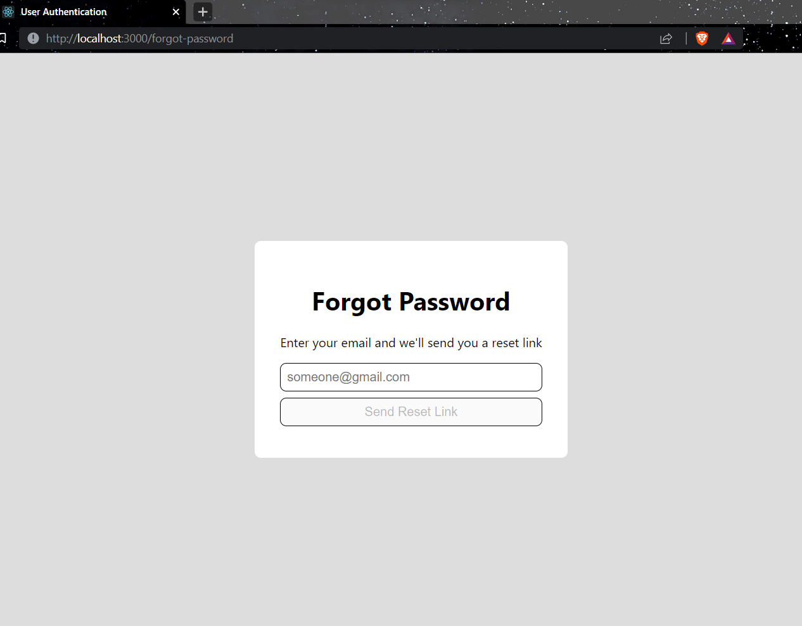
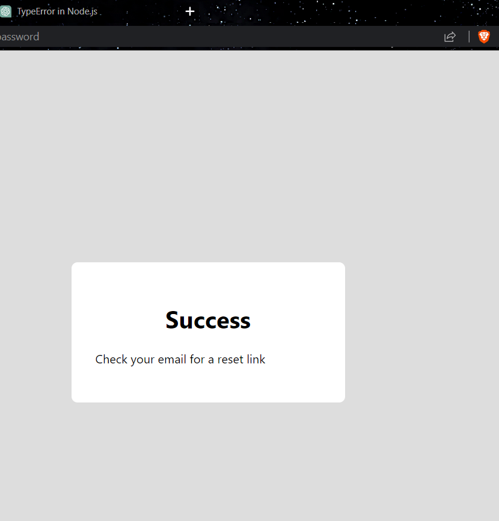

# Resetting Passwords
## Password Reset Steps:
1. The user clicks "forgot password," which takes them to another page.
2. The user enters their email into this page, which sends it to the server.
3. If an account with that email exists, the server generates a verification hash and sends a link to that email address.
4. When the user clicks the link, they're taken to a landing page where they can enter a new password.
5. The new password is sent to the server , which checks to make sure the verification hash matches.
6. If it matches, the user's password is updated and they can log in with their new password.

## Adding a forgot password page.
So the final code for this page is 
```javascript
import { useState } from 'react';
import { useHistory } from 'react-router-dom';
import axios from 'axios';

export const ForgotPasswordPage = () => {
    const [errorMessage, setErrorMessage] = useState('');
    const [success, setSuccess] = useState(false);
    const [emailValue, setEmailValue] = useState('');
    const history = useHistory();

    const onSubmitClicked = async () => {
        try {
            await axios.put(`/api/forgot-password/${emailValue}`);
            setSuccess(true);
            setTimeout(() => {
                history.push('/login');
            }, 3000);
        } catch (e) {
            setErrorMessage(e.message);
        }
    }

    return success ? (
        <div className="content-container">
            <h1>Success</h1>
            <p>Check your email for a reset link</p>
        </div>
    ) : (
        <div className="content-container">
            <h1>Forgot Password</h1>
            <p>Enter your email and we'll send you a reset link</p>
            {errorMessage && <div className="fail">{errorMessage}</div>}
            <input
                value={emailValue}
                onChange={e => setEmailValue(e.target.value)}
                placeholder="someone@gmail.com" />
            <button
                disabled={!emailValue}
                onClick={onSubmitClicked}
            >Send Reset Link</button>
        </div>
    );
}
```

Last thing is we added the route of the page to our routes
```javascript
<Route path="/please-verify">
                    <PleaseVerifyEmailPage />
                </Route>
```

## Sending a reset password email
So, in order for it to actually work what we are going to do is define the route that it can actually send the user's email to. So this route as what we have learned earlier will basically check to see A, if there is already an account with that email address in our database, and B if there is it going to generate the reset code and send it to the users email address.
In our backend we are going to create an new file `forgotPasswordRoute`
The final code for this page is 
```javascript
import { v4 as uuid } from 'uuid';
import { sendEmail } from '../util/sendEmail';
import { getDbConnection } from '../db.js';

export const forgotPasswordRoute = {
    path: '/api/forgot-password/:email',
    method: 'put',
    handler: async (req, res) => {
        const { email } = req.params;

        const db = getDbConnection('react-auth-db');
        const passwordResetCode = uuid();

        const { result } = await db.collection('users')
            .updateOne({ email }, { $set: { passwordResetCode } });

        if (result.nModified > 0) {
            try {
                await sendEmail({
                    to: email,
                    from: 'shaun.linkedin.learning@gmail.com',
                    subject: 'Password Reset',
                    text: `
                        To reset your password, click this link:
                        http://localhost:3000/reset-password/${passwordResetCode}
                    `
                });
            } catch (e) {
                console.log(e);
                res.sendStatus(500);
            }
        }

        res.sendStatus(200);
    }
}
```
After that we imported the route in our `index.js` file
```javascript
import { testRoute } from './testRoute.js';
import { signUpRoute } from './signUpRoute.js';
import { logInRoute } from './logInRoute.js';
import { updateUserInfoRoute } from './updateUserInfoRoute.js';
import { testEmailRoute } from './testEmailRoute.js';
import { verifyEmailRoute } from './verifyEmailRoute.js';
import { forgotPasswordRoute } from './forgotPasswordRoute.js';
 const Rotes = [
    logInRoute,
    signUpRoute,
    testEmailRoute,
    testRoute,
    updateUserInfoRoute,
    verifyEmailRoute,
    forgotPasswordRoute,

];
 export default Rotes

```

## Creating a reset password landing page
We create a new page `passwordReserLandingPage` in our front end, also we created `passwordResetSuccess` & `passwordResetFailed`.
Here is the final code for  `passwordReserLandingPage`
```javascript
import { useState } from 'react';
import { useParams } from 'react-router-dom';
import axios from 'axios';
import { PasswordResetSuccess } from './PasswordResetSuccess';
import { PasswordResetFail } from './PasswordResetFail';

export const PasswordResetLandingPage = () => {
    const [isSuccess, setIsSuccess] = useState(false);
    const [isFailure, setIsFailure] = useState(false);
    const [passwordValue, setPasswordValue] = useState('');
    const [confirmPasswordValue, setConfirmPasswordValue] = useState('');
    const { passwordResetCode } = useParams();

    const onResetClicked = async () => {
        try {
            await axios.put(`/api/users/${passwordResetCode}/reset-password`, { newPassword: passwordValue });
            setIsSuccess(true);
        } catch (e) {
            setIsFailure(true);
        }
    }

    if (isFailure) return <PasswordResetFail />
    if (isSuccess) return <PasswordResetSuccess />

    return (
        <div className="content-container">
            <h1>Reset Password</h1>
            <p>Please enter a new password</p>
            <input
                type='password'
                value={passwordValue}
                onChange={e => setPasswordValue(e.target.value)}
                placeholder="Password" />
            <input
                type='password'
                value={confirmPasswordValue}
                onChange={e => setConfirmPasswordValue(e.target.value)}
                placeholder="Confirm Password" />
            <button
                disabled={!passwordValue || !confirmPasswordValue || passwordValue !== confirmPasswordValue}
                onClick={onResetClicked}
            >Reset Password</button>
        </div>
    )
}
```

Now for the  `passwordResetSuccess`
```javascript
import { useHistory } from 'react-router-dom';

export const PasswordResetSuccess = () => {
    const history = useHistory();

    return (
        <div className="content-container">
            <h1>Success!</h1>
            <p>
                Your password has been reset, now please login with your new password.
            </p>
            <button onClick={() => history.push('/login')}>Log in</button>
        </div>
    );
}
```

Now for the `passwordResetFailed
```javascript
import { useHistory } from 'react-router-dom';

export const PasswordResetFail = () => {
    const history = useHistory();

    return (
        <div className="content-container">
            <h1>Uh oh...</h1>
            <p>
                Something went wrong while trying to reset your password.
            </p>
            <button onClick={() => history.push('/login')}>Back to Log in</button>
        </div>
    );
}
```
Now we imported the pages in our Routes and defined the route
```javascript
 <Route path="/reset-password/:passwordResetCode">
	<PasswordResetLandingPage />
 </Route>
```

## Adding a reset password server endpoint
We have created an new rout called `resetPasswordRoute` in out backend,
Here is the final code for this route
```javascript
import bcrypt from 'bcrypt';
import { getDbConnection } from '../db.js';

export const resetPasswordRoute = {
    path: '/api/users/:passwordResetCode/reset-password',
    method: 'put',
    handler: async (req, res) => {
        const { passwordResetCode } = req.params;
        const { newPassword } = req.body;

        const db = getDbConnection('react-auth-db');

        const newPasswordHash = await bcrypt.hash(newPassword, 10);

        const result = await db.collection('users')
            .findOneAndUpdate({ passwordResetCode }, {
                $set: { passwordHash: newPasswordHash },
                $unset: { passwordResetCode: '' },
            });

        if (result.lastErrorObject.n === 0) return res.sendStatus(404);

        res.sendStatus(200);
    },
}
```
Lastly Iimported the routes in the index.js file
```javascript
import { testRoute } from './testRoute.js';
import { signUpRoute } from './signUpRoute.js';
import { logInRoute } from './logInRoute.js';
import { updateUserInfoRoute } from './updateUserInfoRoute.js';
import { testEmailRoute } from './testEmailRoute.js';
import { verifyEmailRoute } from './verifyEmailRoute.js';
import { forgotPasswordRoute } from './forgotPasswordRoute.js';
import { resetPasswordRoute } from './resetPasswordRoute.js';
 const Rotes = [
    logInRoute,
    signUpRoute,
    testEmailRoute,
    testRoute,
    updateUserInfoRoute,
    verifyEmailRoute,
    forgotPasswordRoute,
    resetPasswordRoute,

];
 export default Rotes

```

Testing due to some error I didn't get email from my code, I will adress this issue later on.
