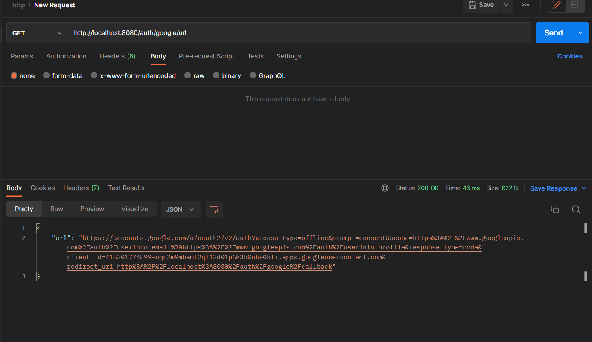
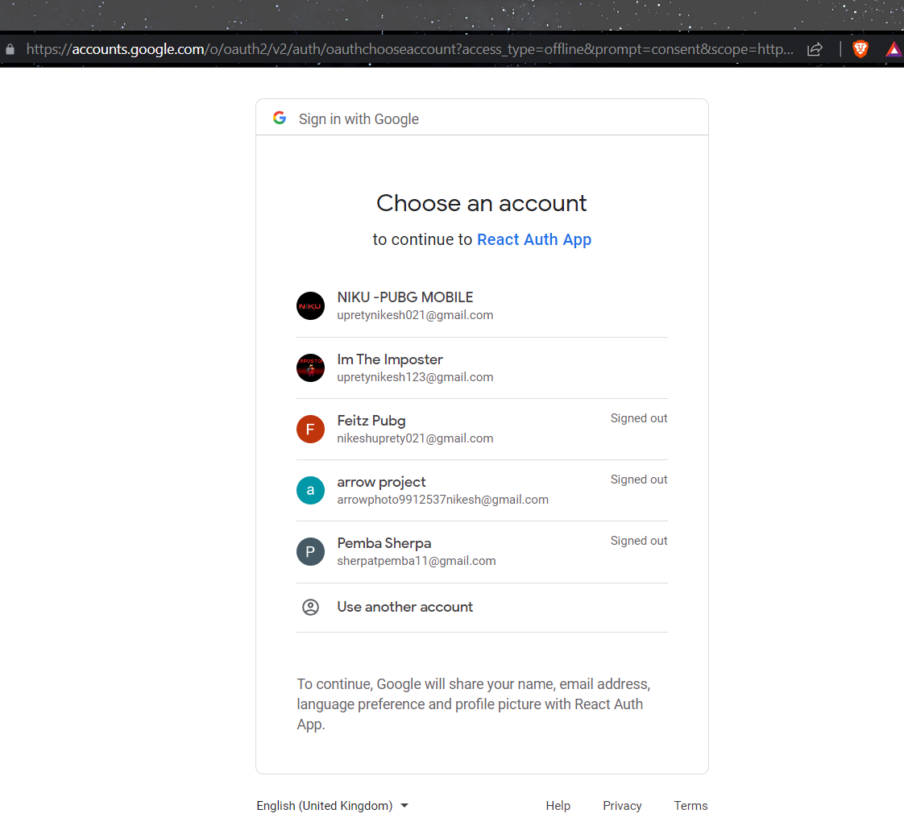
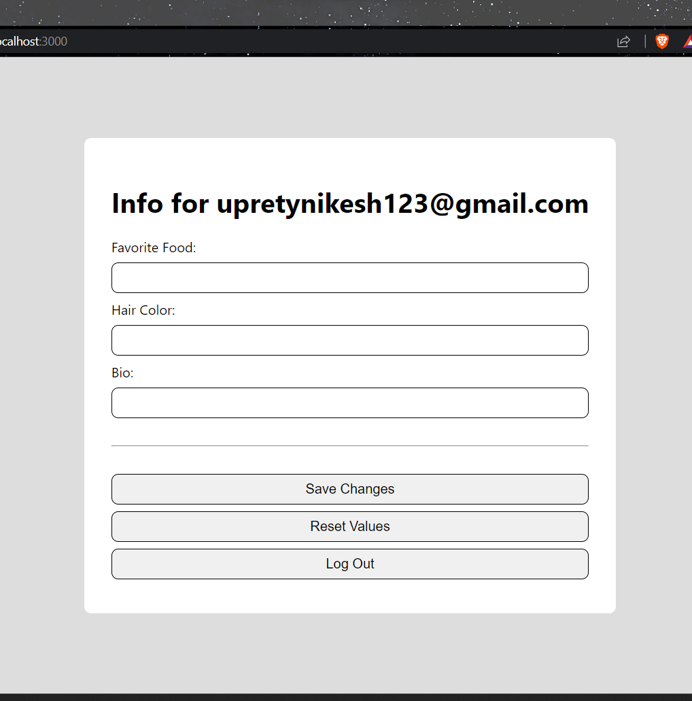

# OAuth Basics
A standard for allowing users to log in to our site using their credentials from another site, such as Google, Linkedin, Github, and others.
## The Three OAuth Parties
1. The user
2. Our app
3. The service provider
## The Basic OAuth Process
1. Generate a special URL for the service-provider's site.
2. Send the user to this URL when they click "Log in with _____"
3. If the user grants us permission, the service provider will redirect them back to our site with a special code.
4. Our site uses this code to load the user's info.
5. We create or update the user's account with the provider's info.
## Setting up OAuth on Google
We head towards console.cloug.google, as I have already logged in I am going to create an new project. 
- Then we select the api and services on the side and, after that we are going to select `OAuth consent screen` .
- We clicked External and hit Create.
- Then we fill the App information and clicked save and continue.
- Then on scopes page, we checked the user email and profile and hit save and continue.
- Then we added an test user.
- Next we goes to Credentials and from the dropdown we select OAuth client ID.
- Then we select web application for application type.
- And then, we gave a name,
- Then on the Authorized Javascript origin, we gave it `http://localhost:8080`
- And on the Authorized URIs we gave it `http://localhost:8080/auth/google/callback`which will redirect the users .
- Then it will open up the windows which contains client id and client secret key
- Then we added those into our .env file into the backend.

So, the first thing we are going to do here is create a route on our server that will generate this URls and send us back to the client.
We made new file in our routes folder names `getGoogleOauthUrlRoute` also we made an utility file names `getGoogleOauthUrl` and `oauthClient`
Next is we installad the npm package `npm install googleapis`

Here is the final code for `oauthClient`
```javascript
import { google } from 'googleapis';

export const oauthClient = new google.auth.OAuth2(
    process.env.GOOGLE_CLIENT_ID,
    process.env.GOOGLE_CLIENT_SECRET,
    'http://localhost:8080/auth/google/callback',
);
```

Here is the final code for `getGoogleOauthUrl`
```javascript
import { oauthClient } from './oauthClient.js';

export const getGoogleOauthUrl = () => {
    const scopes = [
        'https://www.googleapis.com/auth/userinfo.email',
        'https://www.googleapis.com/auth/userinfo.profile',
    ];

    return oauthClient.generateAuthUrl({
        access_type: 'offline',
        prompt: 'consent',
        scope: scopes,
    });
}
```

Here is the final code for  `getGoogleOauthUrlRoute`
```javascript
import { getGoogleOauthUrl } from '../util/getGoogleOauthUrl.js';

export const getGoogleOauthUrlRoute = {
    path: '/auth/google/url',
    method: 'get',
    handler: (req, res) => {
        const url = getGoogleOauthUrl();
        res.status(200).json({ url });
    }
};
```
This code will provide everything that the google need for out project,
By testing it with the postman we get the following URL's that google will use.


## Creating a "Sign in with Google button"
Note that google we only allow to use its own style for styling the button, so, consider this before publishing your app globally.
On the `LoginPage` we added the loginwithgoogle button.
Then we used useEffect hook to load the URL's from our server.
And, we added a simple logic on our login with google button, which states if the URL's is not loaded the button is disabled.
Here is the final code for this page.
```javascript
import { useState, useEffect } from 'react';
import { useHistory } from 'react-router-dom';
import axios from 'axios';
import { useToken } from '../auth/useToken';

export const LogInPage = () => {
    const [token, setToken] = useToken();

    const [errorMessage, setErrorMessage] = useState('');

    const [emailValue, setEmailValue] = useState('');
    const [passwordValue, setPasswordValue] = useState('');

    const [googleOauthUrl, setGoogleOauthUrl] = useState('');

    const history = useHistory();

    useEffect(() => {
        const loadOauthUrl = async () => {
            try {
                const response = await axios.get('/auth/google/url');
                const { url } = response.data;
                setGoogleOauthUrl(url);
            } catch (e) {
                console.log(e);
            }
        }

        loadOauthUrl();
    }, []);

    const onLogInClicked = async () => {
        const response = await axios.post('/api/login', {
            email: emailValue,
            password: passwordValue,
        });
        const { token } = response.data;
        setToken(token);
        history.push('/');
    }

    return (
        <div className="content-container">
            <h1>Log In</h1>
            {errorMessage && <div className="fail">{errorMessage}</div>}
            <input
                value={emailValue}
                onChange={e => setEmailValue(e.target.value)}
                placeholder="someone@gmail.com" />
            <input
                type="password"
                value={passwordValue}
                onChange={e => setPasswordValue(e.target.value)}
                placeholder="password" />
            <hr />
            <button
                disabled={!emailValue || !passwordValue}
                onClick={onLogInClicked}>Log In</button>
            <button onClick={() => history.push('/forgot-password')}>Forgot your password?</button>
            <button onClick={() => history.push('/signup')}>Don't have an account? Sign Up</button>
            <button
                disabled={!googleOauthUrl}
                onClick={() => { window.location.href = googleOauthUrl }}
            >Log in with Google</button>
        </div>
    );
}
```
After clicking the button it takes us to the google OAuth page


## Loading user info from Google
We start by creating the route in our backend, `googleOauthCallbackRoute` and on our utility folder `getGoogleuser` and `updateOrCreateUserFromOauth`
The final code for the `getGoogleuser`
```javascript
import axios from 'axios';
import { oauthClient } from './oauthClient.js';

const getAccessAndBearerTokenUrl = ({ accessToken }) =>
    `https://www.googleapis.com/oauth2/v1/userinfo?alt=json&access_token=${accessToken}`;

export const getGoogleUser = async ({ code }) => {
    const { tokens } = await oauthClient.getToken(code);
    const response = await axios.get(
        getAccessAndBearerTokenUrl({ accessToken: tokens.access_token }),
        { headers: { Authorization: `Bearer ${tokens.id_token}`} },
    );
    return response.data;
}
```
The final code for the `updateOrCreateUserFromOauth` is:
```javascript
import { getDbConnection } from '../db';

export const updateOrCreateUserFromOauth = async ({ oauthUserInfo }) => {
    const {
        id: googleId,
        verified_email: isVerified,
        email,
    } = oauthUserInfo;

    const db = getDbConnection('react-auth-db');
    const existingUser = await db.collection('users').findOne({ email });

    if (existingUser) {
        const result = await db.collection('users').findOneAndUpdate(
            { email },
            { $set: { googleId, isVerified } },
            { returnOriginal: false },
        );
        return result.value;
    } else {
        const result = await db.collection('users').insertOne({
            email,
            googleId,
            isVerified,
            info: {},
        });
        return result.ops[0];
    }
}
```
Here is the final code for `googleOauthCallbackRoute`
```javascript
import jwt from 'jsonwebtoken';
import { getGoogleUser } from '../util/getGoogleUser';
import { updateOrCreateUserFromOauth } from '../util/updateOrCreateUserFromOauth';

export const googleOauthCallbackRoute = {
    path: '/auth/google/callback',
    method: 'get',
    handler: async (req, res) => {
        const { code } = req.query;

        const oauthUserInfo = await getGoogleUser({ code });
        const updatedUser = await updateOrCreateUserFromOauth({ oauthUserInfo });
        const { _id: id, isVerified, email, info } = updatedUser;

        jwt.sign(
            { id, isVerified, email, info },
            process.env.JWT_SECRET,
            (err, token) => {
                if (err) return res.sendStatus(500);
                res.redirect(`http://localhost:3000/login?token=${token}`)
            }
        );
    }
}
```
Then after importing the route in the routes folder, we runned our app .


