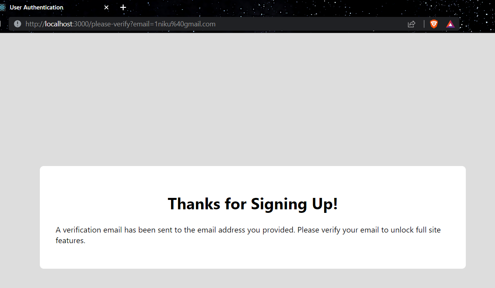
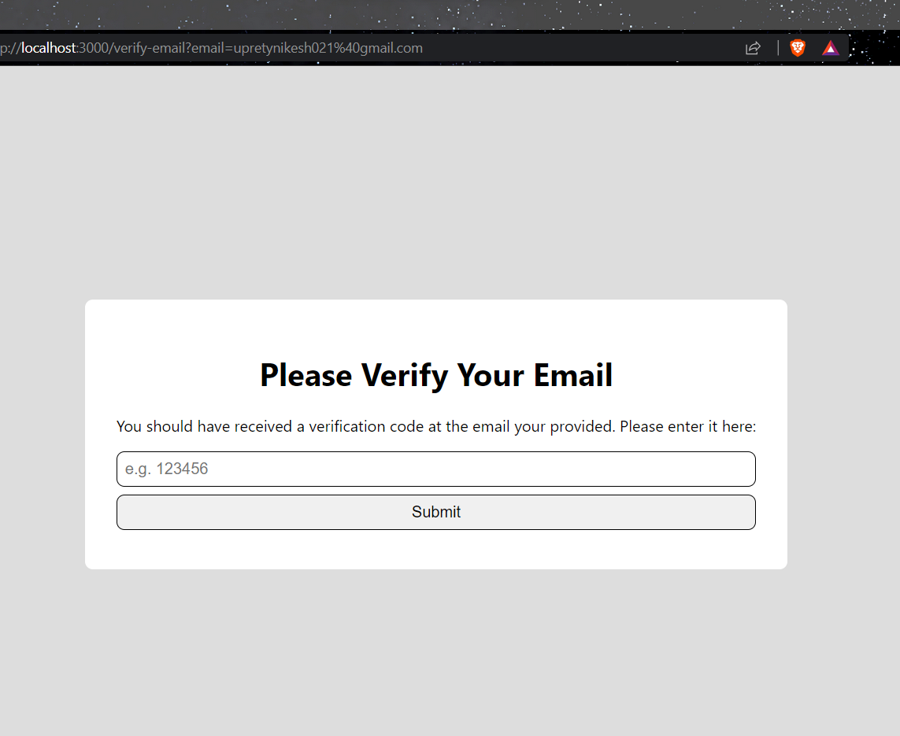
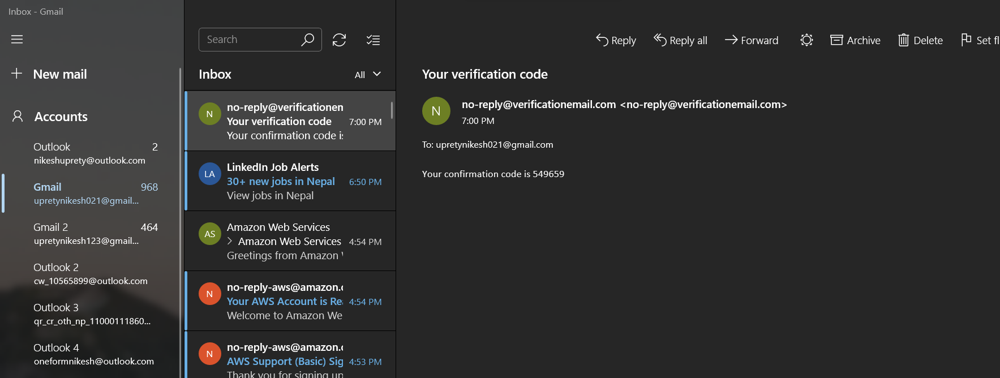
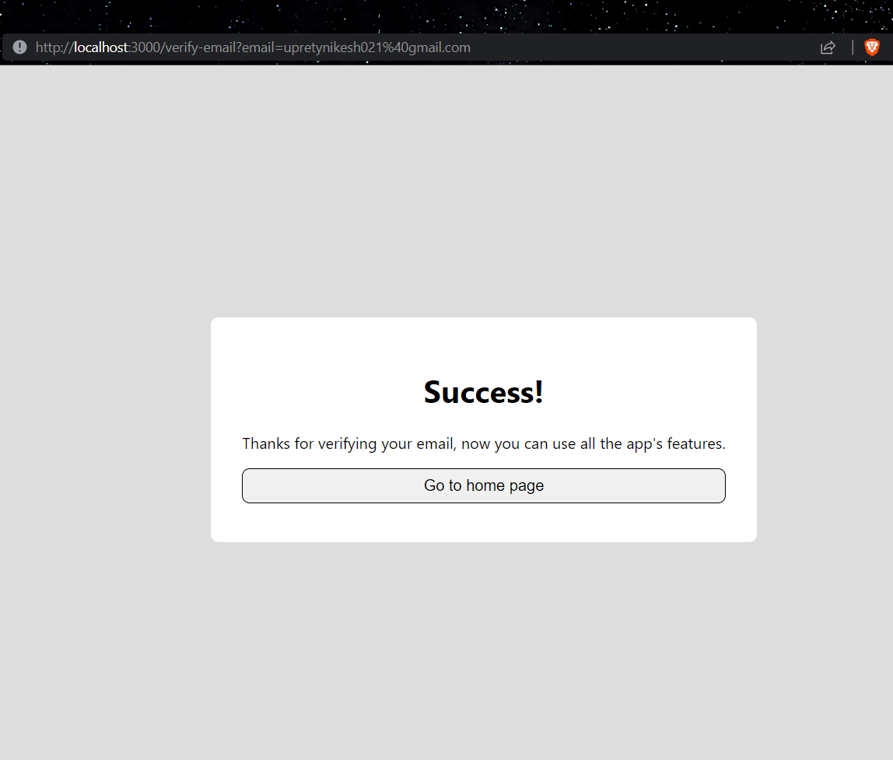
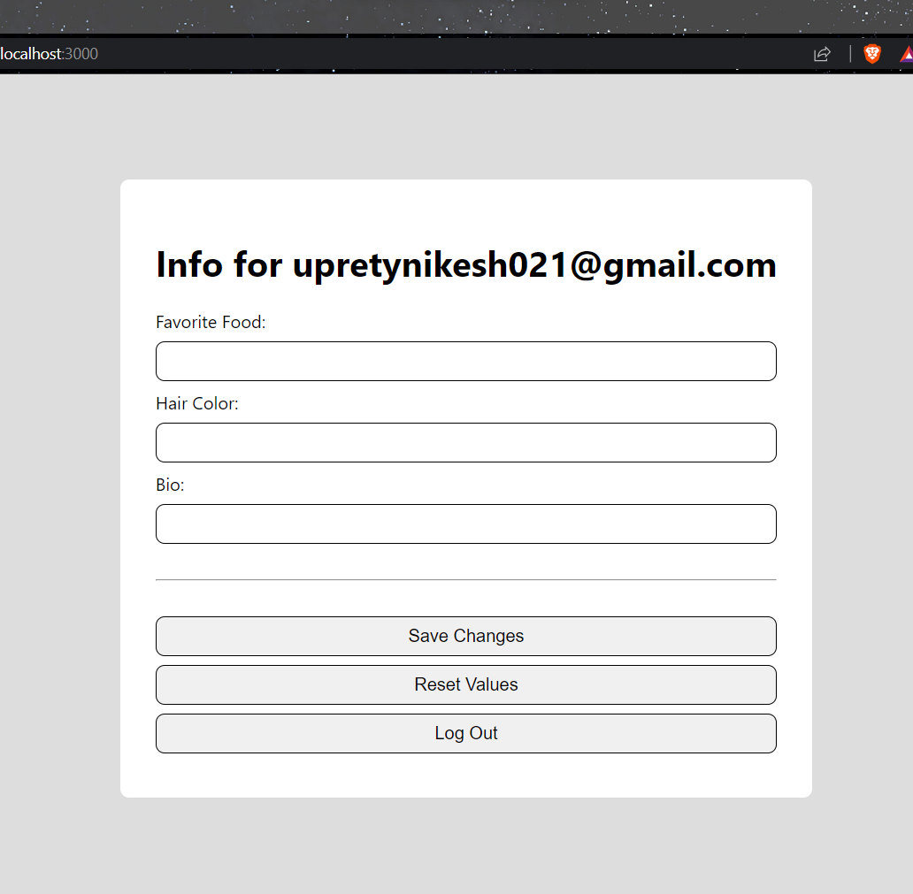
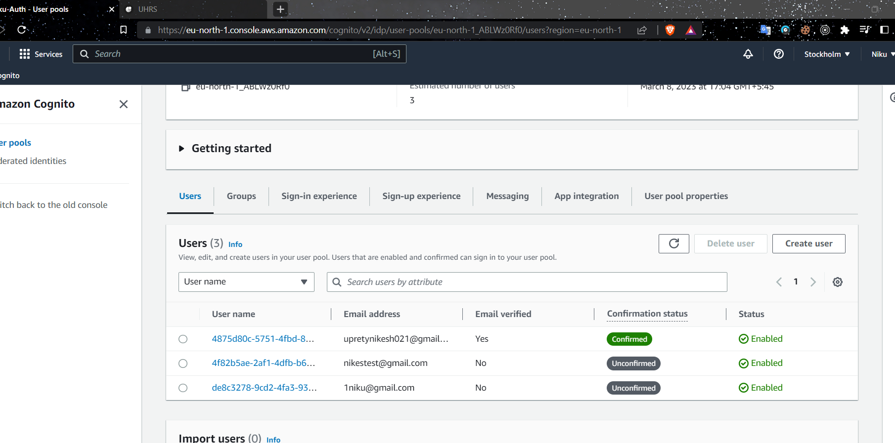

# Amazon Cognito Basics

## Problem
Setting up authentication from scratch gives us flexiblity but this can be bery time consuming!

## The solution (Sometimes)
Third-party authentication providers give us a lot of authentication functionality out of the box.

## AWS Cognito
- Storing user's passwords (and logging in/signing up).
- Verifying email addresses.
- Resetting passwords.
## AWS Cognito Pools
- User pools - store our user's account information.
- Identity pools - keep track of out user's permissions.
## How AWS Cognito Works.
- When a user sings up, we give their username and password to Cognito instead of storing it ourselves.
- When a user logs in, we give their password to Cognito for verification.
- To verify emails, COgnito sends a six-digit code instead of a link.
- A 6-digit code is used for password resets as well.
## Setting up an AWS Cognito project.
- The firsy thing is setting up an AWS account, by signing up.
- Second is searching cognito in the search box.
- Also, we need to add an payment method inorder to view cognito, so after adding that.
- And hit he create an userpool.
- Then settup the info as intrusted in the video, there is 5,6 steps.
- Then after finishing creating the user pool, we added the `AWS_USER_POOL_ID`,` AWS_CLIENT_ID` & ` AWS_REGION` in the `.env` file
- Also, we also need `AWS_IDENTITY_POOL_ID` so we created an identity pool and then got this ID then we also added it into our .env file.
- This is it for setting up the user pool.
## Creating a user pool in Node.js
Our next step, now that we have got user pool and identity pool setup, is going to be a simply start converting our server endpoints and the fron end pages that use them over to use AWS COgnito instead of the homemase setup that we've been using up until now.
First we are going to install few packages in our backend
`npm install aws-sdk amazon-cognito-identity-js node-fetch`

Creating an utility page `awsUserPool.js` for userpool
Here is the final code
```javascript
import { CognitoUserPool } from 'amazon-cognito-identity-js';
import AWS, { CognitoIdentityCredentials } from 'aws-sdk';
import nodeFetch from 'node-fetch';
global.fetch = nodeFetch;

AWS.config.region = process.env.AWS_REGION;
AWS.config.credentials = new CognitoIdentityCredentials({
    IdentityPoolId: process.env.AWS_IDENTITY_POOL_ID,
});

const poolData = {
    UserPoolId: process.env.AWS_USER_POOL_ID,
    ClientId: process.env.AWS_CLIENT_ID,
};

export const awsUserPool = new CognitoUserPool(poolData);
```

Also, updating the signUproute with the awsuserpool
Here is the final updated code
```javascript
import { CognitoUserAttribute } from 'amazon-cognito-identity-js';
import jwt from 'jsonwebtoken';
import { getDbConnection } from '../db.js';
import { awsUserPool } from '../util/awsUserPool.js';

export const signUpRoute = {
    path: '/api/signup',
    method: 'post',
    handler: async (req, res) => {
        const { email, password } = req.body;

        const attributes = [
            new CognitoUserAttribute({ Name: 'email', Value: email }),
        ];

        awsUserPool.signUp(email, password, attributes, null, async (err, awsResult) => {
            if (err) {
                console.log(err);
                return res.status(500).json({ message: 'Unable to sign up user' });
            }

            const db = getDbConnection('react-auth-db');

            const startingInfo = {
                hairColor: '',
                favoriteFood: '',
                bio: '',
            };

            const result = await db.collection('users').insertOne({
                email,
                info: startingInfo,
            });
            const { insertedId } = result;

            jwt.sign({
                id: insertedId,
                isVerified: false,
                email,
                info: startingInfo,
            },
            process.env.JWT_SECRET,
            {
                expiresIn: '2d',
            },
            (err, token) => {
                if (err) return res.sendStatus(500);
                res.status(200).json({ token });
            })
        });
    }
}
```

## Converting the sign-up page to AWS
We do this in the signup page in the front end, we simply added the new route to the history.push with the email encodeURLComponent.
```javascript
history.push(`/please-verify?email=${encodeURIComponent(emailValue)}`);
```
Here is the updated code
```javascript
import { useState } from 'react';
import { useHistory } from 'react-router-dom';
import axios from 'axios';
import { useToken } from '../auth/useToken';

export const SignUpPage = () => {
    const [token, setToken] = useToken();

    const [errorMessage, setErrorMessage] = useState('');

    const [emailValue, setEmailValue] = useState('');
    const [passwordValue, setPasswordValue] = useState('');
    const [confirmPasswordValue, setConfirmPasswordValue] = useState('');

    const history = useHistory();

    const onSignUpClicked = async () => {
        const response = await axios.post('/api/signup', {
            email: emailValue,
            password: passwordValue,
        });
        const { token } = response.data;
        setToken(token);
        history.push(`/please-verify?email=${encodeURIComponent(emailValue)}`);
    }

    return (
        <div className="content-container">
            <h1>Sign Up</h1>
            {errorMessage && <div className="fail">{errorMessage}</div>}
            <input
                value={emailValue}
                onChange={e => setEmailValue(e.target.value)}
                placeholder="someone@gmail.com" />
            <input
                type="password"
                value={passwordValue}
                onChange={e => setPasswordValue(e.target.value)}
                placeholder="password" />
            <input
                type="password"
                value={confirmPasswordValue}
                onChange={e => setConfirmPasswordValue(e.target.value)}
                placeholder="password" />
            <hr />
            <button
                disabled={
                    !emailValue || !passwordValue ||
                    passwordValue !== confirmPasswordValue
                }
                onClick={onSignUpClicked}>Sign Up</button>
            <button onClick={() => history.push('/login')}>Already have an account? Log In</button>
        </div>
    );
}
```

Here is the screenshort of the URL 


## Modifying the email verification flow
We created an new file inside the pages in the frontend, named `EmalVErificationCodePage.js` which takes the verification code to verify the user email by using the code entered by the users
Hers is the final code for this page
```javascript
import { useState } from 'react';
import axios from 'axios';
import { EmailVerificationSuccess } from './EmailVerificationSuccess';
import { EmailVerificationFail } from './EmailVerificationFail';
import { useToken } from '../auth/useToken';
import { useQueryParams } from '../util/useQueryParams';

export const EmailVerificationCodePage = () => {
    const [isSuccess, setIsSuccess] = useState(false);
    const [isFailure, setIsFailure] = useState(false);

    const [verificationString, setVerificationString] = useState('');
    const { email } = useQueryParams();
    const [, setToken] = useToken();

    const onSubmitVerificationString = async () => {
        try {
            const response = await axios.put('/api/verify-email', { email, verificationString });
            const { token } = response.data;
            setToken(token);
            setIsSuccess(true);
        } catch (e) {
            setIsFailure(true);
        }
    }

    if (isSuccess) return <EmailVerificationSuccess />
    if (isFailure) return <EmailVerificationFail />

    return (
        <div className="content-container">
            <h1>Please Verify Your Email</h1>
            <p>You should have received a verification code at the email your provided. Please enter it here:</p>
            <input
                value={verificationString}
                onChange={e => setVerificationString(e.target.value)}
                placeholder="e.g. 123456" />
            <button onClick={onSubmitVerificationString}>Submit</button>
        </div>
    )
}
```
Now we have to add a route to that page in out routes file 
First we imported the file inside the routes file and added an route
```javascript
<Route path="/verify-email" exact>
                    <EmailVerificationCodePage />
                </Route>
```
Last thing that we need to do is, modify our `pleaseverifyemailpage` so that it takes the encodeemailURL.
Here is the final code 
```javascript
import { useEffect } from 'react';
import { useHistory } from 'react-router-dom';
import { useQueryParams } from '../util/useQueryParams';

export const PleaseVerifyEmailPage = () => {
    const history = useHistory();
    const {email}=useQueryParams();
    useEffect(() => {
        setTimeout(() => {
            history.push(`/verify-email?email=${encodeURIComponent(email)}`);
        }, 3000);
    }, [history, email]);

    return (
        <div className="content-container">
            <h1>Thanks for Signing Up!</h1>
            <p>
                A verification email has been sent to the email address you provided.
                Please verify your email to unlock full site features.
            </p>
        </div>
    );
}
```
## Converting the verify email route
Alright we have page where user can enter the verification the Cognito will send them. So, the next thing we're going to do is create a server route that the user can actually send that code to inorder to prove to Cognito that they own the email address.
Lets open the `verifyEmail` route and we are to make a few key changes
Here is the final code
```javascript
import { ObjectID } from 'mongodb';
import jwt from 'jsonwebtoken';
import { CognitoUser } from 'amazon-cognito-identity-js';
import { getDbConnection } from '../db.js';
import { awsUserPool } from '../util/awsUserPool.js';

export const verifyEmailRoute = {
    path: '/api/verify-email',
    method: 'put',
    handler: async (req, res) => {
        const { email, verificationString } = req.body;

        new CognitoUser({ Username: email, Pool: awsUserPool })
            .confirmRegistration(verificationString, true, async (err) => {
                if (err) return res.status(401).json({ message: 'The email verfication code is incorrect' });

                const db = getDbConnection('react-auth-db');
                const result = await db.collection('users')
                    .findOneAndUpdate({ email }, {
                        $set: { isVerified: true }
                    }, {
                        returnOriginal: false,
                    });

                const { _id: id, info } = result.value;

                jwt.sign({ id, email, isVerified: true, info }, process.env.JWT_SECRET, { expiresIn: '2d' }, (err, token) => {
                    if (err) return res.sendStatus(500);
                    res.status(200).json({ token });
                });
            });
    }
}
```
So, lets test it,
After signup it takes us to the verification page, where we enter the verification code

Now, the email is sent to the email, which I used to sign in

After entering the correct code we have successfully verifies

And, now we go bakc to our homepage and the mesg saying verify your account dissapers

Also, in our user pool the after the verification it is marked as confirmed

## Converting the login route
We modified the `loginRoute` page in our backend.
The final code is 
```javascript
import jwt from 'jsonwebtoken';
import {
    AuthenticationDetails,
    CognitoUserPool,
    CognitoUserAttribute,
    CognitoUser,
} from 'amazon-cognito-identity-js';
import { getDbConnection } from '../db.js';
import { awsUserPool } from '../util/awsUserPool.js';

export const logInRoute = {
    path: '/api/login',
    method: 'post',
    handler: async (req, res) => {
        const { email, password } = req.body;

        new CognitoUser({ Username: email, Pool: awsUserPool })
            .authenticateUser(new AuthenticationDetails({ Username: email, Password: password }), {
                onSuccess: async result => {
                    const db = getDbConnection('react-auth-db');
                    const user = await db.collection('users').findOne({ email });

                    const { _id: id, isVerified, info } = user;

                    jwt.sign({ id, isVerified, email, info }, process.env.JWT_SECRET, { expiresIn: '2d' }, (err, token) => {
                        if (err) {
                            res.sendStatus(500);
                        }

                        res.status(200).json({ token });
                    });
                },
                onFailure: err => {
                    res.sendStatus(401);
                }
            });

    },
}
```
Now that the login in successfully update and working fine.
## Converting the forgot password route
Again, we going the update the `forgotpasswordpageRoute` in our backend
Here is the final modified code for this page
```javascript
import { CognitoUser } from 'amazon-cognito-identity-js';
import { awsUserPool } from '../util/awsUserPool.js';

export const forgotPasswordRoute = {
    path: '/api/forgot-password/:email',
    method: 'put',
    handler: async (req, res) => {
        const { email } = req.params;

        new CognitoUser({ Username: email, Pool: awsUserPool })
            .forgotPassword({
                onSuccess: () => {
                    res.sendStatus(200);
                },
                onFailure: () => {
                    res.sendStatus(500);
                },
            })
    }
}
```
Now in the frontend , we modified `forgotpassword` page, by sending the user to a new route with URL when the user clicked the forgot password button
The final code for this page is 
```javascript
import { useState } from 'react';
import { useHistory } from 'react-router-dom';
import axios from 'axios';

export const ForgotPasswordPage = () => {
    const [errorMessage, setErrorMessage] = useState('');
    const [success, setSuccess] = useState(false);
    const [emailValue, setEmailValue] = useState('');
    const history = useHistory();

    const onSubmitClicked = async () => {
        try {
            await axios.put(`/api/forgot-password/${emailValue}`);
            setSuccess(true);
            setTimeout(() => {
                history.push(`/reset-password?email=${encodeURIComponent(emailValue)}`);
            }, 3000);
        } catch (e) {
            setErrorMessage(e.message);
        }
    }

    return success ? (
        <div className="content-container">
            <h1>Success</h1>
            <p>Check your email for a reset link</p>
        </div>
    ) : (
        <div className="content-container">
            <h1>Forgot Password</h1>
            <p>Enter your email and we'll send you a reset link</p>
            {errorMessage && <div className="fail">{errorMessage}</div>}
            <input
                value={emailValue}
                onChange={e => setEmailValue(e.target.value)}
                placeholder="someone@gmail.com" />
            <button
                disabled={!emailValue}
                onClick={onSubmitClicked}
            >Send Reset Link</button>
        </div>
    );
}
```
## Rewriting the reset password endpoint
On the backend we modified `resetPasswordRoute` file
Here is the final modified code,
```javascript
import { CognitoUser } from 'amazon-cognito-identity-js';
import { awsUserPool } from '../util/awsUserPool.js';

export const resetPasswordRoute = {
    path: '/api/users/:passwordResetCode/reset-password',
    method: 'put',
    handler: async (req, res) => {
        const { passwordResetCode } = req.params;
        const { email, newPassword } = req.body;

        new CognitoUser({ Username: email, Pool: awsUserPool })
            .confirmPassword(passwordResetCode, newPassword, {
                onSuccess: () => {
                    res.sendStatus(200);
                },
                onFailure: () => {
                    res.sendStatus(401);
                }
            });
    },
}
```
## Converting the reset password page,
In this page we are going the take the verification code, and reset the password of the user.
Here is the final code for passwordResetLandingpage
```javascript
import { useState } from 'react';
import axios from 'axios';
import { PasswordResetSuccess } from './PasswordResetSuccess';
import { PasswordResetFail } from './PasswordResetFail';
import { useQueryParams } from '../util/useQueryParams';

export const PasswordResetLandingPage = () => {
    const [isSuccess, setIsSuccess] = useState(false);
    const [isFailure, setIsFailure] = useState(false);
    const [passwordValue, setPasswordValue] = useState('');
    const [confirmPasswordValue, setConfirmPasswordValue] = useState('');
    const [passwordResetCode, setPasswordResetCode] = useState('');
    const { email } = useQueryParams();

    const onResetClicked = async () => {
        try {
            await axios.put(`/api/users/${passwordResetCode}/reset-password`, { email, newPassword: passwordValue });
            setIsSuccess(true);
        } catch (e) {
            setIsFailure(true);
        }
    }

    if (isFailure) return <PasswordResetFail />
    if (isSuccess) return <PasswordResetSuccess />

    return (
        <div className="content-container">
            <h1>Reset Password</h1>
            <p>Please enter a new password</p>
            <input
                value={passwordResetCode}
                onChange={e => setPasswordResetCode(e.target.value)}
                placeholder="Password Reset Code" />
            <input
                type='password'
                value={passwordValue}
                onChange={e => setPasswordValue(e.target.value)}
                placeholder="Password" />
            <input
                type='password'
                value={confirmPasswordValue}
                onChange={e => setConfirmPasswordValue(e.target.value)}
                placeholder="Confirm Password" />
            <button
                disabled={!passwordValue || !confirmPasswordValue || passwordValue !== confirmPasswordValue}
                onClick={onResetClicked}
            >Reset Password</button>
        </div>
    )
}
```
Unfortunately there is some error due to which password reset is not working, I will be addressing this issue and update as soon as possible.
